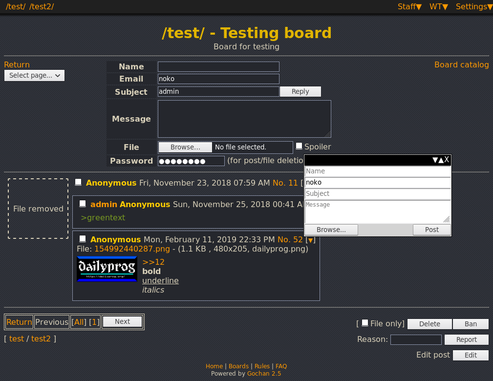
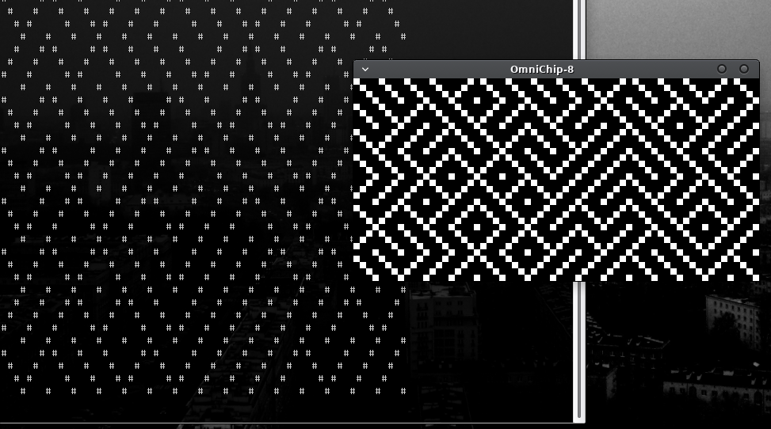
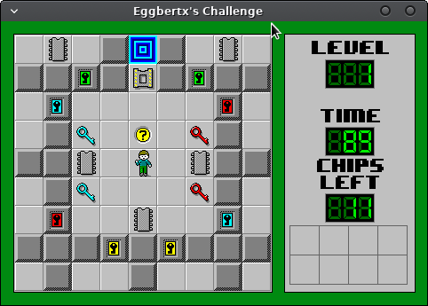
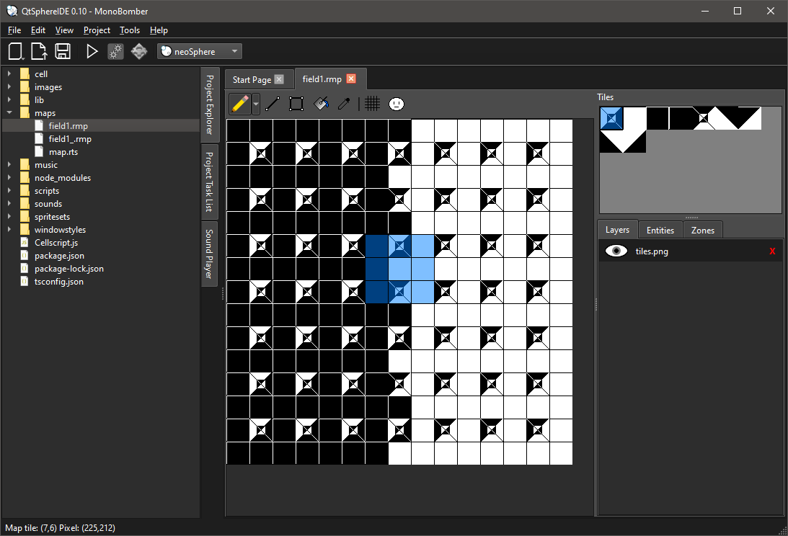

## My GitHub projects
Here are some of my more interesting (depending on who you ask) programming projects.

### Gochan

A semi-standalone Futaba-style imageboard server written in [Go](https://golang.org)

[GitHub repo](https://github.com/gochan-org/gochan) | [Website](https://gochan.org)

Language: Go (server), HTML (templates), JavaScript, and Sass/CSS

___
### OmniChip-8

A CHIP-8 emulator with the goal of being compatible with as many systems as possible. It currently supports SDL, (n)curses, GameBoy, and Commodore 64.

Language: C (C89)

[GitHub repo](https://github.com/eggbertx/OmniChip8)

___
### Eggbertx's Challenge

A Chip's Challenge implementation written in GDScript using the [Godot](https://godotengine.org/) game engine

Language: GDScript

[GitHub repo](https://github.com/Eggbertx/Eggbertxs-Challenge)

___
### QtSphere IDE

A cross-platform IDE for the Sphere game engine using the Qt toolkit

[GitHub repo](https://github.com/eggbertx/QtSphere-IDE)

Language: C++

