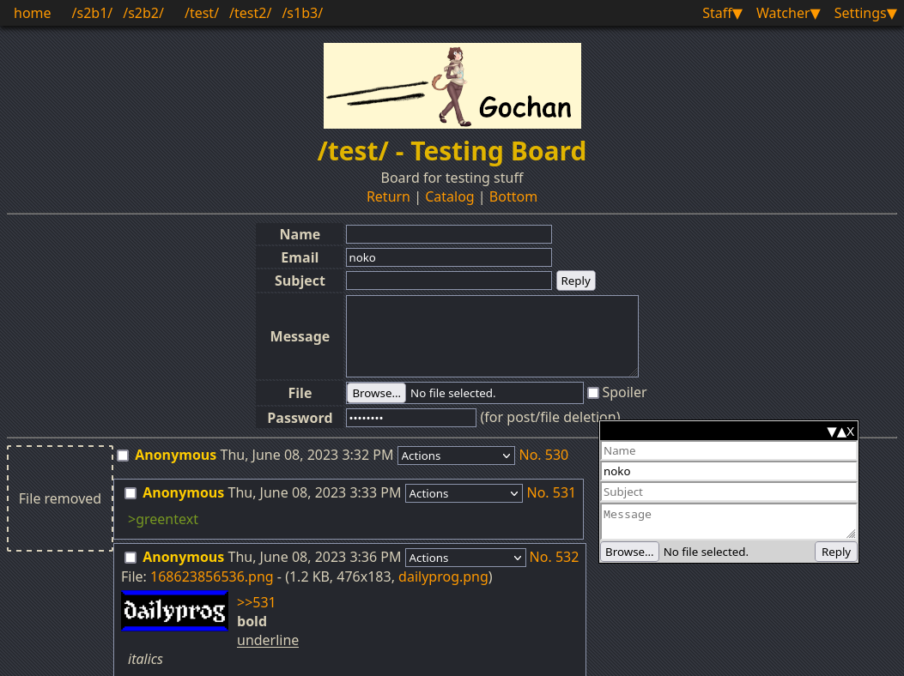
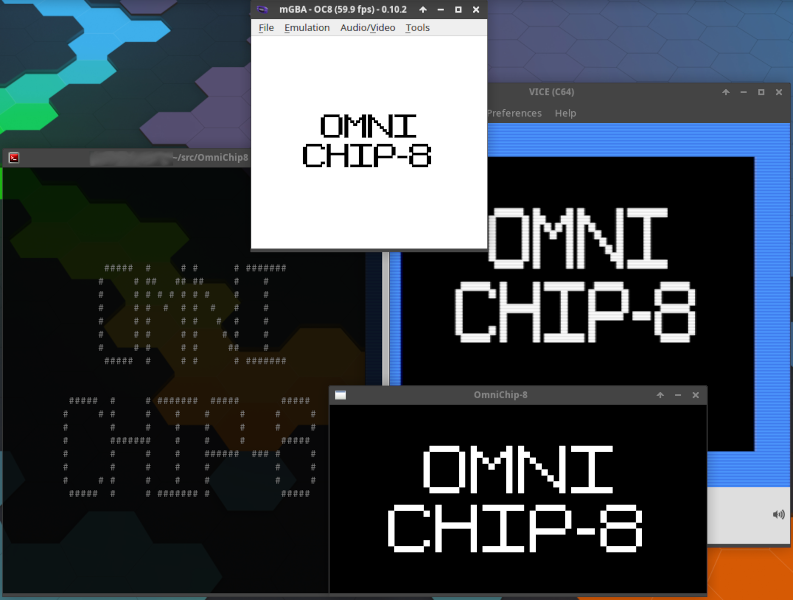
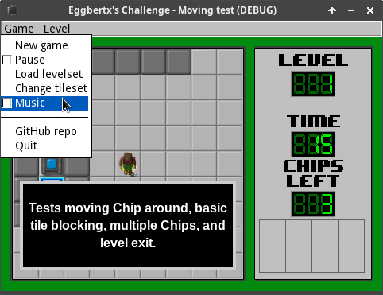

## My GitHub projects
Here are some of my main programming projects.

### Gochan

A semi-standalone Futaba-style imageboard server written in [Go](https://golang.org)

[GitHub repo](https://github.com/gochan-org/gochan) | [Website](https://gochan.org)

Language: Go (server), HTML (templates), TypeScript, and SCSS

___
### GD6502

A [6502](https://en.wikipedia.org/wiki/MOS_Technology_6502) emulator written in GDScript using the [Godot](https://godotengine.org/) game engine

Language: GDScript

GitHub repos: [IDE](https://github.com/Eggbertx/GD6502-IDE), [core](https://github.com/Eggbertx/GD6502)

___
### QtSphere IDE

A cross-platform IDE/resource editor for the Sphere game engine using the Qt toolkit via [PySide6](https://doc.qt.io/qtforpython-6/)

[GitHub repo](https://github.com/eggbertx/QtSphere-IDE)

Language: Python

___
### OmniChip-8

A CHIP-8 emulator with the goal of being compatible with as many systems as possible. It currently supports SDL, (n)curses, GameBoy, and Commodore 64.

Language: C (C89), tests using CTest+gtest in C++

[GitHub repo](https://github.com/eggbertx/OmniChip8)

___
### Eggbertx's Challenge

A Chip's Challenge implementation written in GDScript using the [Godot](https://godotengine.org/) game engine

Language: GDScript

[GitHub repo](https://github.com/Eggbertx/Eggbertxs-Challenge)

___
### Simple 3D Raycaster

A simple project to teach myself how to do traditional Wolfenstein 3D style raycasting, as well as CMake usage

Language: C

[GitHub repo](https://github.com/Eggbertx/simple-3d-raycaster)

